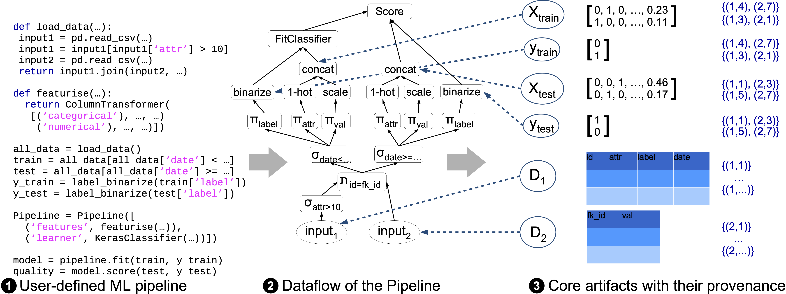

# mlprov: Efficient Provenance Tracking for ML Pipelines

This assignment is using Python as programming language. We suggest that you use **Python3.11** and install the required libraries exactly like specified in [requirements.txt](requirements.txt) via a [virtualenv](https://docs.python.org/3/library/venv.html) to avoid potential incompatibilities.


## Description
Your task is to build `mlprov`, a library to build ML pipelines with row-level provenance tracking using the existing interfaces from `scikit-learn` and `pandas`. And the nice thing: with a few tricks (like using DuckDB), the performance of the ML pipelines written with `mlprov` will be even better than the original pandas and scikit-learn! 

The following Figure shows what this provenance looks like for a small example pipeline for some key pipeline artifacts:

On top of this provenance, many different use cases can be implemented. Here are three examples you will implement:

1) Data Leakage Detection using Provenance
2) GDPR compliance: Have I been trained?
3) Assessing Group Fairness.

From a user perspective, the only necessary change to a user pipeline should be to change the imports:
```python
import pandas
import sklearn
import numpy
```
just need to be changed to

```python
import mlprov.pandas
import mlprov.sklearn
import mlprov.numpy
```
This should work for a number of example pipelines. Please also include functionality that stores the core provenance artefacts of a ML pipeline, as shown in the example Figure, in the `MLProvManager` class, for which we provide a skeleton [here](/mlprov/_prov_manager.py). Also, please use the provenance to implement the three example queries listed above that use the provenance. For these use cases we provide skeleton classes that you will need to change [here](/mlprov/prov_analysis).
Once the library is fully built, users should be able to run queries like this after executing their ML pipelines:
```python
# Get MLProvManager singleton
prov_manager = MLProvManager()

# Now we can get data artefacts from the previous pipeline execution
train_data = prov_manager.get_training_data_for_classifier(fitted_model)
train_labels = prov_manager.get_training_labels_for_classifier(fitted_model)
test_data = prov_manager.get_test_data_for_classifier(pipeline_score)
test_predictions = prov_manager.get_test_predictions_for_score(pipeline_score)
test_labels = prov_manager.get_test_true_labels_for_score(pipeline_score)
source_tables = prov_manager.get_source_tables_for_classifier_and_eval(fitted_model, pipeline_score)

# Or run analyses using the provenance
assert DataLeakage.check_data_leakage(train_data, train_labels, test_data, test_predictions, test_labels, source_tables) is False
```
## Provenance representation and storage
In the overview Figure above you see the provenance in blue on the right side in the form of provenance sets, e.g., `{(1, 4), (2, 7)}`. This set of tuples represents the origin of the rows of the respective pipeline (intermediate) result. In this case, each tuple refers to one row in one of the source tables that were used to compute the given row. E.g., `(1, 4)` refers that the fourth row of the first initial input table were used to compute the given row. For our project, key questions are where and how to store this provenance information. When storing the provenance of each row as a set of tuples, like in the Figure we use for explanation, we would need to generate thousands of Python objects for each intermediate result, which would result in bad performance. Instead of using plain Python, we want to use more efficient representations than this. For our ML pipeline usecase here, it is sufficient to represent the provenance for a given intermediate result in a Python dataframe. Each row in this provenance dataframe represents the provenance for the row with the respective index in the intermediate result. And instead of using a set of tuples, we use one column for each initial input table to store the integer index of the rows from that input table that were used to compute the current row.
So `{(1, 4), (2, 7)}` could be stored like this:

| Input Table 1 | Input Table 2 |
|---------------|---------------|
| 4             | 7             |


The next question is where we should store the provenance information for each intermediate result of our pipeline. The easiest way is to just store it in the intermediate result object. So we subclass intermediate results like pandas `DataFrame`s with our own `ProvDataFrame`, that inherits from `DataFrame`, but also adds an attribute where we can store the provenance dataframe.
Finally, in the end of the pipeline, we want to know the most important intermediate results of the pipeline for follow-up analysis. These intermediate results, as shown in the example figure, are the train_data, train_labels, test_data, test_predictions, test_labels, and source_tables. How can we identify those key artifacts in complex pipelines? The easiest way is to look at which variables are the input to `model.fit(train_data, train_labels)` of the ML model used in the end of the pipeline, as well as the input to the final score computation, e.g., the sklearn function `accuracy_score(test_predictions, test_labels)`. For `test_predictions`, we also want to know the `test_data` that resulted in the predictions, thus, we can also store the `test_data` intermediate result from the `model.predict` function call. So we want to overwrite the `model.fit`, `model.score`, metric computation functions like `accuracy_score`, and `model.predict` to store these core pipeline artifacts with their provenance somewhere. One way to do this is to store the result in the fitted model object and the computed score metric (we can also subclass classes like floats). Then, we can use a class like the `ProvManager` to extract these core pipeline artifacts with their provenance from arbitrary pipeliens given just the fitted model and the score object. Based on this, we can then implement different pipeline analyses. 

## Exemplary provenance applications
As part of this project, you are tasked with implemeting three different ML pipeline analyses that work with the key pipeline artifacts and their provenance, as seen in the exemplary Figure. In the following, we will explain each problem and how provenance can help with it.

1) *Data Leakage Detection using Provenance*: Data leakage is when parts of the ML pipeline test data is contained in the training data. Thus, all model performance metrics are misleading, because the model has already seen the data it is being tested on. Using provenance, you can quickly check if rows from the test set matrix are also contained in the train set matrix by checking the intersection of their provenance.
2) *GDPR compliance: Have I been trained?*: Users of online services have a right to know how their data is used. With provenance, we can easily accomplish tasks like seeing which rows from which tables have been used to train an ML model by looking at the provenance of the train data matrix. This allows us to easily tell users what exactly their personal data is used for.
3) *Assessing Group Fairness*: Fairness evaluations of ML pipelines often require you to consider sensitive demographic features like `age`, `gender`, or `race`. However, in many cases, you cannot (and should not) use those features to train your ML model. Thus, these features often get removed from the data using projections early in ML pipelines. However, to compute fairness metrics for ML pipelines on the test data, we need this demographic side information! Provenance can help with this: we can use the provenance to join the test set predictions and true labels with the sensitive column information by using the provenance of the test data.

We already provide skeletons for these provenance analyses [here](/mlprov/prov_analysis).
## Getting started
Please note that the skeleton code we provide is only a starting point to develop your own solution.  You may edit all existing code except the existing tests, and this is even be required to build a full working solution.

While working on this project, we recommend to follow a two-step approach. First, make sure that your solution implements all the required functionality. After, you can optimize the performance until you reach the required performance thresholds (e.g., making pandas calls with added provenance tracking faster by using DuckDB instead of pandas).

To implement the provenance tracking functionality, you can start by adding provenance support operator by operator. 
read_csv is a simple pandas function to get familiar with the idea. [Here](/test/test_loaders.py) we already provide a test that checks your solution for correctness. The function that you need to implement is located [here](/mlprov/pandas/_loaders.py). First, you need to think about how you want to represent the provenance. The skeleton interface for this is the `ProvenanceMixin` located [here](/mlprov/_prov_mixin.py). For pandas DataFrames, the skeleton already contains a `ProvDataFrame` that extends the standard DataFrame and implements the provenance interface. It is located [here](mlprov/pandas/_wrappers.py). One way to represent the provenance is to use a dict of numpy arrays, with the keys being a reference to a specific version of a source table and the values being numpy arrays with the row index in the datasource. With this code you can make the initial read_csv test pass:
```python
import pandas as orig_pandas
from mlprov.pandas._wrappers import DataFrame
```
...
```python
def read_csv(filepath_or_buffer, *args, **kwargs):
    df = orig_pandas.read_csv(filepath_or_buffer, *args, **kwargs)
    prov_df = DataFrame(df)
    return prov_df
```
For this, you need to extend the `MLProvManager` (located [here](/mlprov/_prov_manager.py)) with the following functions: 
```python
def get_next_table_id(self):
    next_table_id = self._next_table_id
    self._next_table_id += 1
    return next_table_id
```

```python
def register_input_table(self, table: any):
    self._all_input_tables.append(table)
```
Furthemore, you need to add the following code to the [DataFrame](mlprov/pandas/_wrappers.py) in line 11:
```python
provenance_dict = {f"{MLProvManager().get_next_table_id()}": orig_numpy.arange((len(self)))}
self.provenance = OrigDataFrame(provenance_dict)
MLProvManager().register_input_table(self)
```
with the following imports:
```python
import numpy as orig_numpy
from pandas import DataFrame as OrigDataFrame
from mlprov import MLProvManager
```
By adding this code, you can know which rows of the table with the index are used in the current table.

Please note that this is only one way to implement this, and that you might want to change this later.

Once the provenance tracking works, you can look into implementing the missing functions in the `MLProvManager` located [here](/mlprov/_prov_manager.py) and the analyses that use the provenance, for which we provide skeleton classes that you will need to change [here](/mlprov/prov_analysis).

Once this example works, you can look into the next operator, e.g., a pandas projection or selection by overwriting the pandas `DataFrame` function `__getitem__` in our `ProvDataFrame` class. We recommend starting by first writing a test, like the one for `test_read_csv`.

Once that works, you can start to look into more complicated pipelines from [here](/example_pipelines). [Here](/test/test_full_pipeline_prov.py) we already provide a unit test for an end-to-end pipeline as a starting point.

Then, you are on your own: add support for more complex pipeline, add utility functions for getting and working with the provenance, and optimize the performance of your library! 

## Performance

Once your library works, part of the project will be to optimise it's performance. Especially operations like [joins](https://pandas.pydata.org/docs/reference/api/pandas.merge.html) and [selections](https://pandas.pydata.org/docs/user_guide/indexing.html#the-where-method-and-masking) might be slower due to the performance overhead of provenance tracking. However, you can use other tricks to improve the performance of your library. E.g., by not relying on the original slow implementation of certain operations from pandas, but by using more efficient alternatives like [duckdb](https://duckdb.org/docs/guides/python/sql_on_pandas).


## Code quality

We additionally ask you to write correct, efficient, well-structured and easy to-read code. Furthermore, your code should run without issues on the machines of the TAs.


## About the skeleton code we provide
Note that we already provide quite a lot of code to help you get started. However, please feel free to edit the existing code as you want, even the tests, as long as your code still supports all the functionality that needs to be supported. Depending on your implementation choices, it might even be required to change some of the existing code. Also, to create a high-quality solution, you will most likely need to refactor and change parts of the code we provide to help you get started. Similarity to the original skeleton code is not an evaluation criteria, only your final project submission quality. Also, the tests we provide are just intended to be a small help with getting started, but they are not sufficient. You will be required to write many more tests yourself.

## Grading

The TAs will execute and review your code for this assignment and will deduct points for missing, incorrect, or inefficient code. Please also refer to the detailed grading criteria from the course. The grading criteria include dimensions like the number of supported ML pipelines, libraries, and operators, the performance of mlprov compared to the original libraries without provenance tracking, the number of applications implemented on top of the provenance, as well as any additional features you might implement on top of the minimum requirements.
